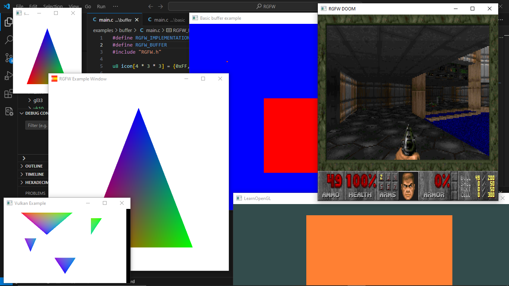

# Riley's Graphics library FrameWork


## Build statuses


[](https://discord.gg/pXVNgVVbvh) 

matrix: [](https://matrix.to/#/#rsgl-is-sili:matrix.org)

A cross-platform lightweight single-header very simple-to-use window abstraction library for creating graphics Libraries or simple graphical programs. Written in pure C99.

# About
RGFW is a free multi-platform single-header very simple-to-use window abstraction framework for creating graphics Libraries or simple graphical programs. It is meant to be used as a very small and flexible alternative library to GLFW. 

The window backend supports XLib (UNIX), Cocoas (MacOS), wasm (emscripten) and WinAPI (tested on windows *XP*, 10 and 11, and reactOS)\
Windows 95 & 98 have also been tested with RGFW, although results are iffy  

Wayland: to compile wayland add (RGFW_WAYLAND=1). Wayland support is very experimental and broken.

The graphics backend supports OpenGL (EGL, software, OSMesa, GLES), Vulkan, DirectX, [Metal](https://github.com/RSGL/RGFW-Metal) and software rendering buffers.

RGFW was designed as a backend for RSGL, but it can be used standalone or for other libraries, such as Raylib which uses it as an optional alternative backend.

RGFW is multi-paradigm,\
By default RGFW uses a flexible event system, similar to that of SDL, however you can use callbacks if you prefer that method. 

This library

1) is single header and portable (written in C99 in mind)
2) is very small compared to other libraries
3) only depends on system API libraries, Winapi, X11, Cocoa
4) lets you create a window with a graphics context (OpenGL, Vulkan or DirectX) and manage the window and its events only with a few function calls 
5) is customizable, you enable or disable features

This library does not

1) Handle any rendering for you (other than creating your graphics context)
2) do anything above the bare minimum in terms of functionality 

# Getting started
## a very simple example
```c
#define RGFW_IMPLEMENTATION
#include "RGFW.h"

#include <stdio.h>

void keyfunc(RGFW_window* win, RGFW_key key, char keyChar, RGFW_keymod keyMod, RGFW_bool pressed) {
    if (key == RGFW_escape && pressed) {
        RGFW_window_setShouldClose(win);
    }
}

int main() {
    RGFW_window* win = RGFW_createWindow("a window", RGFW_RECT(0, 0, 800, 600), RGFW_windowCenter | RGFW_windowNoResize);

    RGFW_setKeyCallback(keyfunc); // you can use callbacks like this if you want

    while (RGFW_window_shouldClose(win) == RGFW_FALSE) {
        while (RGFW_window_checkEvent(win)) {  // or RGFW_window_checkEvents(); if you only want callbacks
            // you can either check the current event yourself
            if (win->event.type == RGFW_quit) break;
            
            if (win->event.type == RGFW_mouseButtonPressed && win->event.button == RGFW_mouseLeft) {
                printf("You clicked at x: %d, y: %d\n", win->event.point.x, win->event.point.y);
            }

            // or use the existing functions
            if (RGFW_isMousePressed(win, RGFW_mouseRight)) {
                printf("The right mouse button was clicked at x: %d, y: %d\n", win->event.point.x, win->event.point.y);
            }
        }
        
        glClearColor(0.1f, 0.1f, 0.1f, 1.0f);
        glClear(GL_COLOR_BUFFER_BIT);

        // You can use modern OpenGL techniques, but this method is more straightforward for drawing just one triangle.
        glBegin(GL_TRIANGLES);
        glColor3f(1, 0, 0); glVertex2f(-0.6, -0.75);
        glColor3f(0, 1, 0); glVertex2f(0.6, -0.75);
        glColor3f(0, 0, 1); glVertex2f(0, 0.75);
        glEnd();

        RGFW_window_swapBuffers(win);
    }

    RGFW_window_close(win);
    return 0;
}
```

```sh
linux : gcc main.c -lX11 -lGL -lXrandr
windows : gcc main.c -lopengl32 -lgdi32
macos : gcc main.c -framework CoreVideo -framework Cocoa -framework OpenGL -framework IOKit
```

## Dynamic Linking with XDL.h
XDL can be used to dynamically link X11 functions to RGFW using `dl`. It allows X11 functions to loaded at runtime.

To enable RGFW's use of XDL, add this line to your code:

```c
#define RGFW_USE_XDL
```

## Linking OpenGL is not required
This only applies to Windows, macOS and X11 (with `XDL.h`):
    
    
By default, OpenGL does not need to be explicitly linked unless you are directly using OpenGL functions in your code. If you rely on a OpenGL loader library, you don't need to explicitly link OpenGL at all!

    
The examples/gl33/gl33 example demonstrates using OpenGL without explicitly linking it. 

## other examples


You can find more examples [here](examples) or [run it in your browser](https://colleagueriley.github.io/RGFW/) with emscripten

# Officially tested Platforms 
- Windows (ReactOS, XP, Windows 10, 11)
- Linux
- MacOS (10.13, 10.14, 10.15) (x86_64)
- HTML5 (wasm / Emscripten)
- Raspberry PI OS

# Supported GUI libraries
A list of GUI libraries that can be used with RGFW can be found on the RGFW wiki [here](https://github.com/ColleagueRiley/RGFW/wiki/GUI-libraries-that-can-be-used-with-RGFW)

# Documentation
There is a lot of in-header-documentation, but more documentation can be found at https://colleagueriley.github.io/RGFW/docs/index.html
If you wish to build the documentation yourself, there is also a Doxygen file attached.

# Bindings
A list of bindings can be found on the RGFW wiki [here](https://github.com/ColleagueRiley/RGFW/wiki/Bindings)

# projects
A list of projects that use RGFW can be found on the RGFW wiki [here](https://github.com/ColleagueRiley/RGFW/wiki/Projects-that-use-RGFW)

# Contacts
- email : ColleagueRiley@gmail.com 
- discord : ColleagueRiley
- discord server : https://discord.gg/pXVNgVVbvh
- matrix space: https://matrix.to/#/#rsgl-is-sili:matrix.org
- BlueSky https://bsky.app/profile/colleagueriley.bsky.social
- Twitter/X : https://x.com/ColleagueRiley

# Supporting RGFW
  There is a RGFW wiki page about things you can do if you want to support the development of RGFW [here](https://github.com/ColleagueRiley/RGFW/wiki/Supporting-RGFW).

# RGFW vs GLFW
A comparison of RGFW and GLFW can be found at [on the wiki](https://github.com/ColleagueRiley/RGFW/wiki/RGFW-vs-GLFW)

# License
RGFW uses the Zlib/libPNG license, this means you can use RGFW freely as long as you do not claim you wrote this software, mark altered versions as such and keep the license included with the header.

```
Permission is granted to anyone to use this software for any purpose,
including commercial applications, and to alter it and redistribute it
freely, subject to the following restrictions:
  
1. The origin of this software must not be misrepresented; you must not
   claim that you wrote the original software. If you use this software
   in a product, an acknowledgment in the product documentation would be
   appreciated but is not required. 
2. Altered source versions must be plainly marked as such, and must not be
   misrepresented as being the original software.
3. This notice may not be removed or altered from any source distribution.
```
