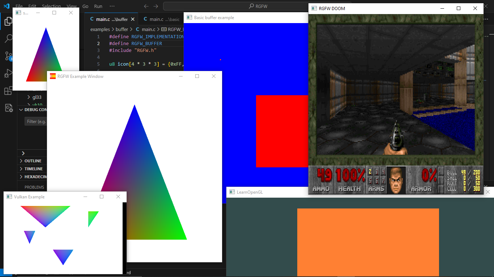

# Riley's General Framework for Windowing


**RGFW** is a focused general windowing framework for creating and handling windows, graphics contexts and windowing inputs with a minimalistic and easy to modify implementation.

---

<br>

[](https://discord.gg/pXVNgVVbvh)


# Features

* **is** an stb-style single headerfile and is very portable
* **is** primarly written in C99 in mind
* **has** a C89 compatible API
* **is** a flexible and can be used in multiple ways to best fit your use case
* **is** very small compared to other libraries
* **is** a general framework and can be used for games, apps or tools
* **does** only depend on system API libraries, Winapi, X11, Cocoa, etc **NO** dependencies
* **does** help you create a window with a graphics context (OpenGL, Vulkan, WebGPU, Metal, or DirectX) and manage the window and its events only with a few function calls
* **is** customizable, you enable or disable features
* **does** work with X11 (UNIX), Wayland (*experimental*) (LINUX), Cocoa (MacOS), Emscripten (WASM) and WinAPI (tested on windows *XP*, 10, 11, reactOS and has limited 9x support)
* **is** multi-paradigm, with a flexible event system, including multiple ways of handling events (callbacks, queue, state lookups)
* **does** include a large number of examples for learning RGFW

* does **not** handle any rendering for you (other than creating your graphics context)
* is **not** an OpenGL focused library, RGFW can be used with ANY graphics API
* does **not** do anything above the bare minimum in terms of functionality


There is a Makefile including for compiling the examples. NOTE: `WAYLAND=1` OR  can be defined to compile for wayland. `WAYLAND_X11=1` can be used instead if you want examples to fallback to X11 if a Wayland display is not found. This adds `#define RGFW_WAYLAND` in the implementation (or defines `RGFW_WAYLAND` AND `RGFW_X11`)

Included in the framework are helper functions for multiple rendering APIs OpenGL (Native, EGL, GLES), Vulkan, DirectX, [Metal](https://github.com/ColleagueRiley/RGFW/blob/main/examples/metal/metal.m) and WebGPU, you can also easily blit raw data directly onto the window with the `RGFW_surface` object using `RGFW_window_blitSurface`.

You must explicitly request these helper functions via, `#define RGFW_OPENGL`, `#define RGFW_VULKAN`, `#define RGFW_DIRECTX`, `#define RGFW_WEBGPU`.

# Getting started
## a very simple example
```c

/*
   this example doesn't have any graphics, for a graphics example see the other examples
   examples/dx11/dx11 -> DirectX
   examples/metal/metal -> Metal
   examples/gl11/gl11 -> OpenGL 1.1
   examples/gl33/gl33 -> OpenGL 3.3
   examples/gles2/gles2 -> OpenGL ES 2
   examples/egl/egl -> egl
   examples/surface/surface -> software rendering
*/

#define RGFW_IMPLEMENTATION
#include "RGFW.h"

#include <stdio.h>

void keyfunc(const RGFW_event* event) {
    if (event->key.value == RGFW_keyEscape) {
        RGFW_window_setShouldClose(event->common.win, 1);
    }
}

int main() {
    RGFW_window* win = RGFW_createWindow("a window", 0, 0, 800, 600, RGFW_windowCenter | RGFW_windowNoResize);

    RGFW_setEventCallback(RGFW_keyPressed, keyfunc); // you can use callbacks like this if you want

    i32 mouseX, mouseY;

    while (RGFW_window_shouldClose(win) == RGFW_FALSE) {
        RGFW_event event;
        while (RGFW_window_checkEvent(win, &event)) {  // or RGFW_pollEvents(); if you only want callbacks / state checking
            RGFW_window_getMouse(win, &mouseX, &mouseY);

            if (event.type == RGFW_mouseButtonPressed && event.button.value == RGFW_mouseLeft) {
                printf("You clicked at x: %d, y: %d\n", mouseX, mouseY);
            }
        }

        /* state checking */
        if (RGFW_isMousePressed(RGFW_mouseRight)) {
            printf("The right mouse button was clicked at x: %d, y: %d\n", mouseX, mouseY);
        }
    }

    RGFW_window_close(win);
    return 0;
}
```


```sh
linux : gcc main.c -lX11 -lGL -lm -lXrandr
windows : gcc main.c -lopengl32 -lgdi32
macos : gcc main.c -framework Cocoa
```

## other examples


You can find more examples [here](examples) or [run it in your browser](https://colleagueriley.github.io/RGFW/) with emscripten

# Supported GUI libraries
A list of GUI libraries that can be used with RGFW can be found on the RGFW wiki [here](https://github.com/colleagueriley/RGFW/wiki/GUI-libraries-that-can-be-used-with-RGFW)

# Documentation
There is a lot of in-header-documentation, but more documentation can be found at https://colleagueriley.github.io/RGFW/docs/index.html
If you wish to build the documentation yourself, there is also a Doxygen file attached.

# Bindings
A list of bindings can be found on the RGFW wiki [here](https://github.com/ColleagueRiley/RGFW/wiki/Bindings)

# projects
A list of projects that use RGFW can be found on the RGFW wiki [here](https://github.com/ColleagueRiley/RGFW/wiki/Projects-that-use-RGFW)

# Contacts
- email : ColleagueRiley@gmail.com
- discord : ColleagueRiley
- discord server : https://discord.gg/pXVNgVVbvh
- matrix space: https://matrix.to/#/#rsgl-is-sili:matrix.org
- BlueSky https://bsky.app/profile/colleagueriley.bsky.social
- Twitter/X : https://x.com/ColleagueRiley

# Supporting RGFW
  There is a RGFW wiki page about things you can do if you want to support the development of RGFW [here](https://github.com/ColleagueRiley/RGFW/wiki/Supporting-RGFW).

# License
RGFW uses the Zlib/libPNG license, this means you can use RGFW freely as long as you do not claim you wrote this software, mark altered versions as such and keep the license included with the header.

```
Permission is granted to anyone to use this software for any purpose,
including commercial applications, and to alter it and redistribute it
freely, subject to the following restrictions:

1. The origin of this software must not be misrepresented; you must not
   claim that you wrote the original software. If you use this software
   in a product, an acknowledgment in the product documentation would be
   appreciated but is not required.
2. Altered source versions must be plainly marked as such, and must not be
   misrepresented as being the original software.
3. This notice may not be removed or altered from any source distribution.
```
